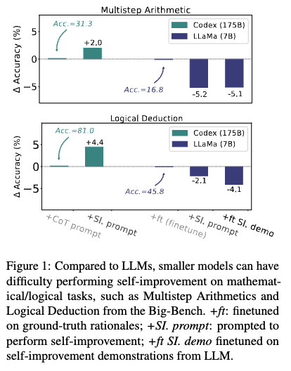
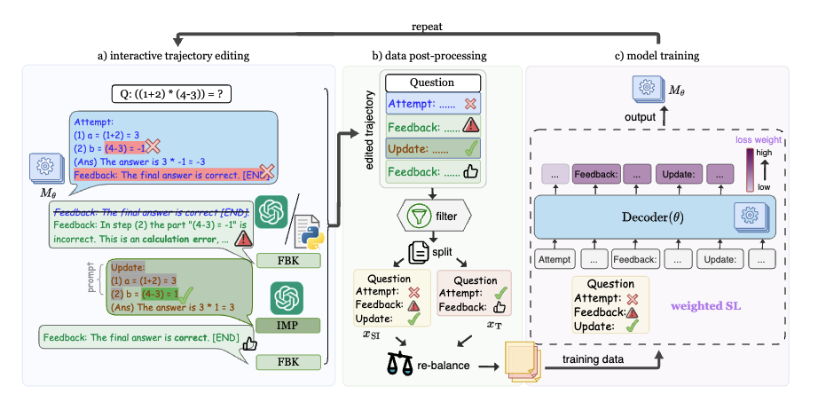

# TriPosT

This repository will provide soon an implementation of TriPosT, which is described in this paper:

**Teaching Language Models to Self-Improve through Interactive Demonstrations** 
*Xiao Yu, Baolin Peng, Michel Galley, Jianfeng Gao, Zhou Yu*

Motivating example:

TriPosT Algorithm:

